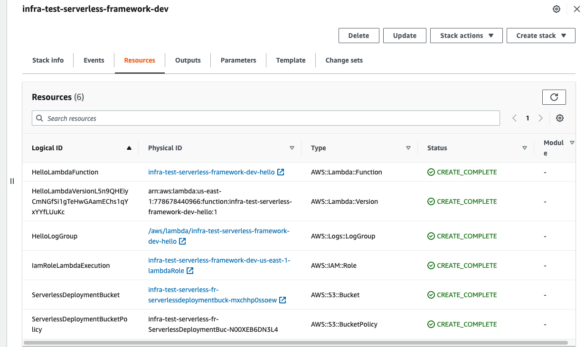
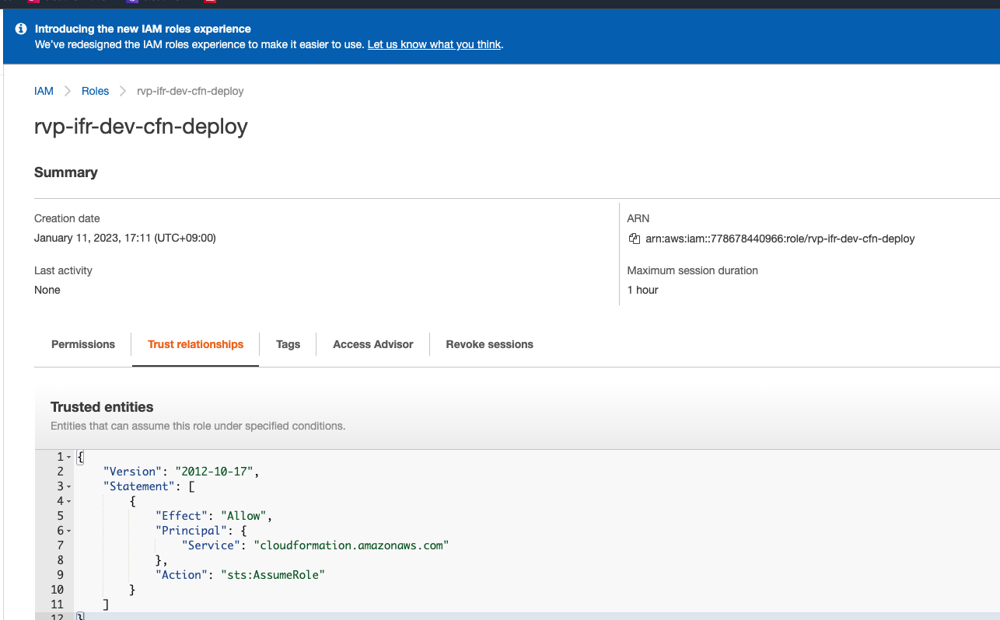
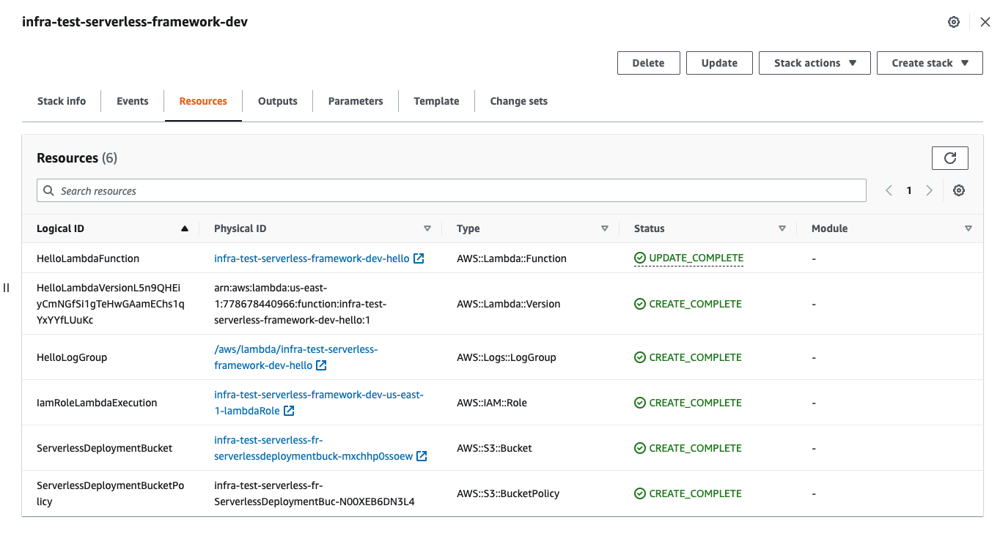

## MEMO

### 環境

```
docker compose up -d
docker compose exec sls-deploy /bin/bash
```

### 初回 deploy

```bash
sls deploy
Serverless: Packaging service...
Serverless: Excluding development dependencies...
Serverless: Creating Stack...
Serverless: Checking Stack create progress...
........
Serverless: Stack create finished...
Serverless: Uploading CloudFormation file to S3...
Serverless: Uploading artifacts...
Serverless: Uploading service infra-test-serverless-framework.zip file to S3 (3.43 kB)...
Serverless: Validating template...
Serverless: Updating Stack...
Serverless: Checking Stack update progress...
...............
Serverless: Stack update finished...
Service Information
service: infra-test-serverless-framework
stage: dev
region: us-east-1
stack: infra-test-serverless-framework-dev
resources: 6
api keys:
  None
endpoints:
functions:
  hello: infra-test-serverless-framework-dev-hello
layers:
  None
```
```bash
sls invoke --function hello
```
```json
{
    "statusCode": 200,
    "body": "{\"message\": \"Go Serverless v2.0! Your function executed successfully!\", \"input\": {}}"
}
```


### Role 作成

```bash
iam_cfn_service_role.sh deploy
```


### deploymentRole を付与して、 serverless deploy

- serverless.yml
    ```diff
    provider:
    name: aws
    runtime: python3.8
    lambdaHashingVersion: 20201221
    +  iam:
    +    deploymentRole: ${cf:rvp-ifr-dev-cfn-service-role.DeployRoleForCloudFormationArn}
    ```
- deploy
    ```bash
    sls deploy
    Serverless: Packaging service...
    Serverless: Excluding development dependencies...
    Serverless: Uploading CloudFormation file to S3...
    Serverless: Uploading artifacts...
    Serverless: Uploading service infra-test-serverless-framework.zip file to S3 (228.05 kB)...
    Serverless: Validating template...
    Serverless: Updating Stack...
    Serverless: Checking Stack update progress...
    .........
    Serverless: Stack update finished...
    Service Information
    service: infra-test-serverless-framework
    stage: dev
    region: us-east-1
    stack: infra-test-serverless-framework-dev
    resources: 6
    api keys:
    None
    endpoints:
    functions:
    hello: infra-test-serverless-framework-dev-hello
    layers:
    None
    Serverless: Removing old service artifacts from S3...
    ```
    

### 削除

- lambda 削除

    ```
    sls remove
    ```

- IAM 削除

    ```
    export AWS_REGION="us-east-1"
    aws --profile revamp cloudformation delete-stack --stack-name rvp-ifr-dev-cfn-service-role
    ```
